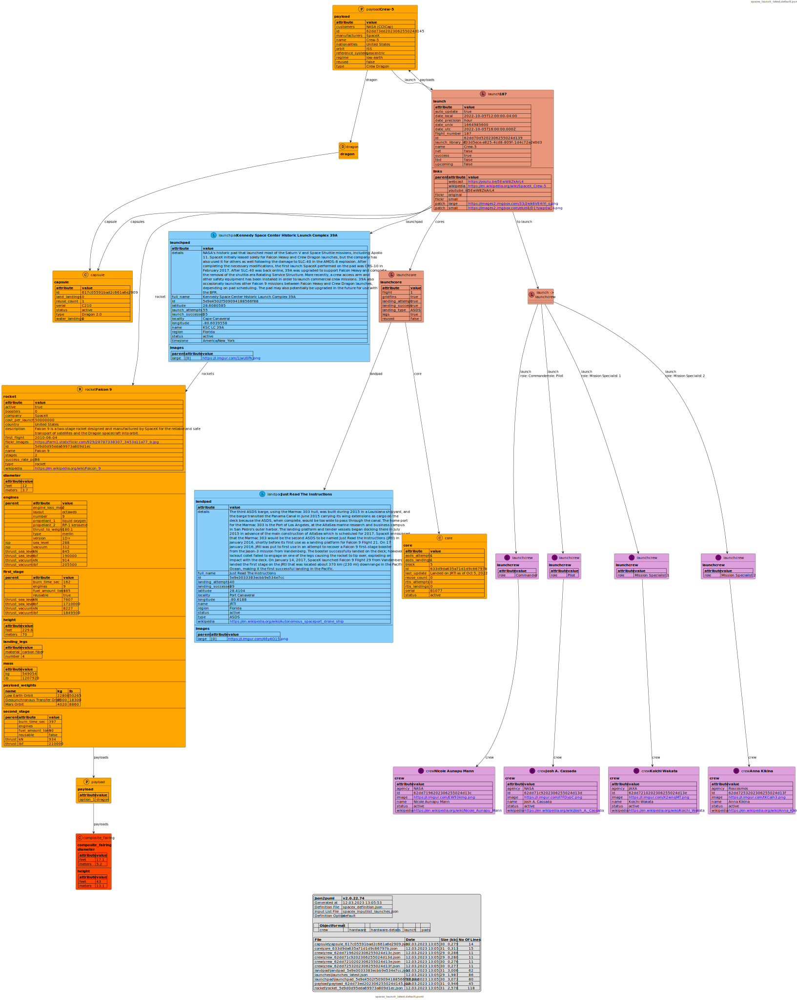

# **json2puml** 

Make data visible and understandable

# One Solution for multiple needs
 * **json2puml** is a command line tool developed to generate PlantUML files based JSON files.
 * **json2puml** has an understanding of how data is structured (in TMF) and simplifies and visualises the outcome.
 * **json2puml** has the possibility to combine the JSON results of multiple API calls into one result set.
 * **json2puml** is highly configurable to generate outcomes in different detailed levels.
 * **json2puml** is free to use for everyone.

# How can it be used
 * **json2puml** is available as
	 * Windows command line utility
	 * Windows base microservice
	 * Linux command line utility  (standalone and as a docker container)
	 * Linux based microservice (standalone and as a docker container)

# How it's working
**json2puml** is based on three different steps:
1. [optional] Fetch json files via curl command line utility
2. Convert json files into plantuml configuration files
3. [optional] Use the Plantuml executabe to generate images based on the plantuml configuration files.

**plantuml** is a wonderfull tool to generate a various type of images and diagrams based on a text definition file.
You can find further details around **plantuml** here : https://plantuml.com/en/

The generated outcome can look like this image of an SpaceX launch sample:

# How to start
A full documentation can be found in the documentation folder.
Sample files for different public api's can be found in the samples folder.

# License
**json2puml** is free software; you can redistribute it and/or modify it under the terms of the GNU General Public License as published by the Free Software Foundation; either version 3 of the License, or (at your option) any later version.

This program is distributed in the hope that it will be useful, but WITHOUT ANY WARRANTY; without even the implied warranty of MERCHANTABILITY or FITNESS FOR A PARTICULAR PURPOSE. 
See the GNU General Public License for more details.

You should have received a copy of the GNU General Public License along with this program; if not, see http://www.gnu.org/licenses/gpl-3.0

I am available for any questions/requests: jens.fudickar@oratool.de

You may retrieve the latest version of this file at the json2puml home page,
located at https://github.com/jfudickar/json2puml

# Folder Overview
## configuration
Central configuration files.

## docker
Script files to define, build and run the docker files.

## documentation
All documentation files.

## installation
All files needed to build the **json2puml** solution.

## sample
A set sample files to demonstrate the use and the power of  **json2puml**.

## source
All source files needed to compile the **json2puml**.

The source code is based on Embarcardero Delphi. It is tested with Delphi 10.2 and upwards.

To compile the linux utilities an enterprise edition license is needed.

**json2puml** makes use of the following open source frameworks:
- DelphiMVCFramework ((https://github.com/danieleteti/delphimvcframework)
- QuickLogger (https://github.com/exilon/QuickLogger)
- SynEdit (https://github.com/SynEdit/SynEdit)
  Optional only needed in the UI
- SVGIconImageList (https://github.com/EtheaDev/SVGIconImageList) 
  Optional only needed in the UI

